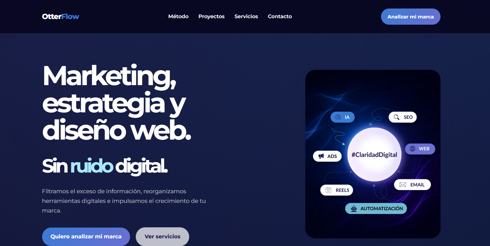
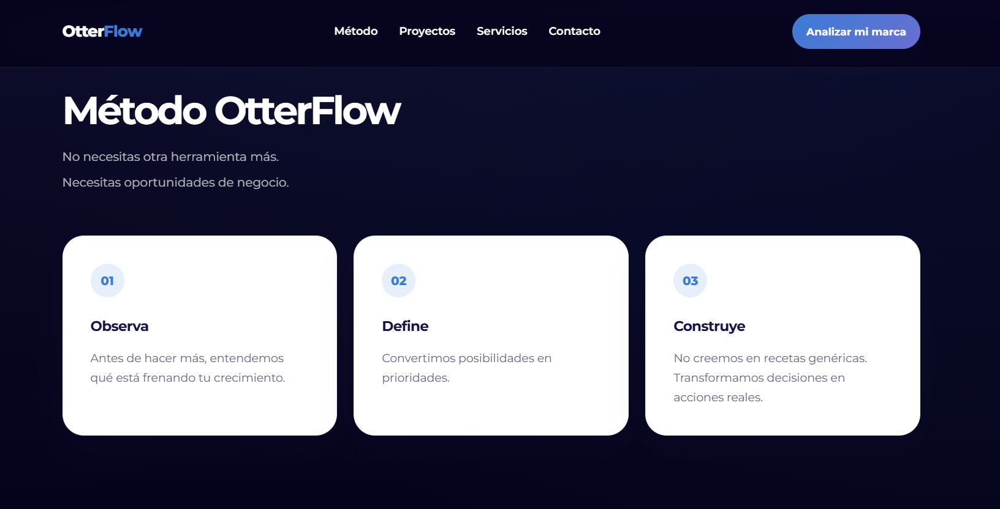
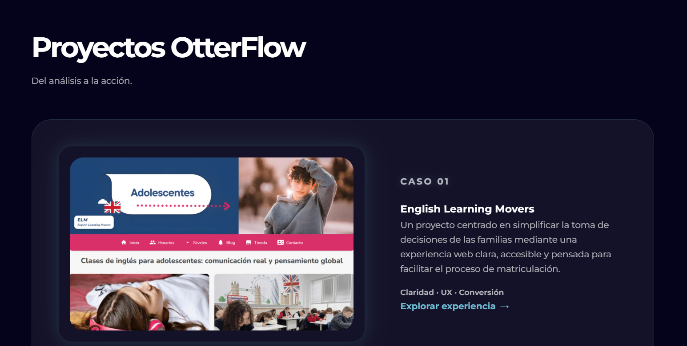

# OtterFlow

Landing page oficial de OtterFlow.

Una marca enfocada en aportar claridad digital, dirección estratégica y experiencias digitales que ayuden a las marcas a tomar mejores decisiones y avanzar con confianza.

## 🌐 Demo

https://otterflow-studio.netlify.app

## 📌 Sobre el proyecto

OtterFlow nace como una propuesta de crecimiento digital centrada en la estrategia, la observación y la construcción de experiencias digitales con sentido.

La landing presenta:

- Propuesta de valor de la marca.
- Método OtterFlow (Observa, Define, Construye).
- Proyectos desarrollados.
- Servicios.
- Formulario de contacto.
- Identidad visual propia basada en el sistema de personajes OtterFlow.

## 🎯 Objetivos

- Construir una web profesional para la marca OtterFlow.
- Aplicar principios de diseño responsive.
- Mejorar la percepción de valor y la claridad narrativa.
- Crear una experiencia coherente con el posicionamiento de la marca.
- Implementar buenas prácticas básicas de SEO y accesibilidad.

## 🛠️ Tecnologías utilizadas

- HTML5
- CSS3
- JavaScript
- Netlify
- GitHub

## 📱 Diseño Responsive

La web ha sido optimizada y revisada para:

- Móvil
- Tablet
- Portátiles
- Escritorio

## 🔍 SEO y rendimiento

Implementaciones realizadas:

- Meta Title
- Meta Description
- Open Graph
- Twitter Cards
- Favicon
- Imágenes optimizadas en WebP
- Accesibilidad revisada
- Lighthouse optimizado

## 🎨 Identidad visual

La marca utiliza una estética inspirada en la idea de un océano digital:

- Claridad digital
- Dirección
- Fluidez
- Observación
- Inteligencia aplicada

El sistema visual incorpora los personajes:

- Otter Guide
- Otter Observa
- Otter Flow

como representación de las distintas fases del método OtterFlow.

## 📷 Capturas

### Home

### Método OtterFlow

### Proyectos

## 👩‍💻 Autora

Eva Dozo

Marketing · Estrategia · Diseño web

